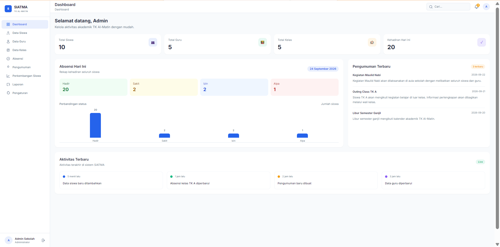
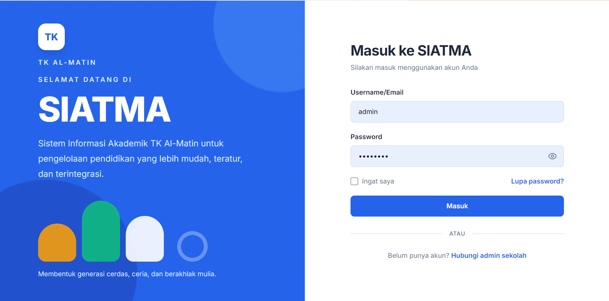
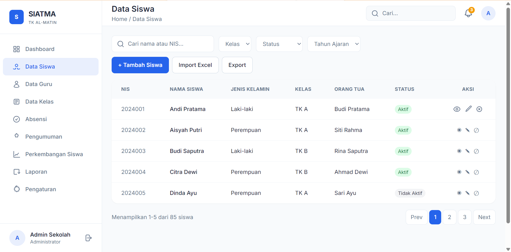
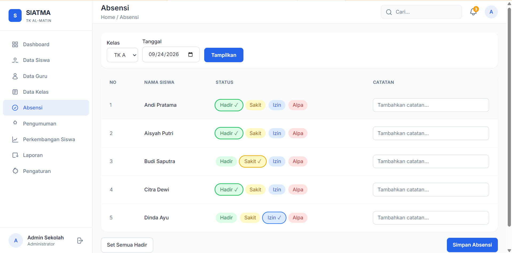
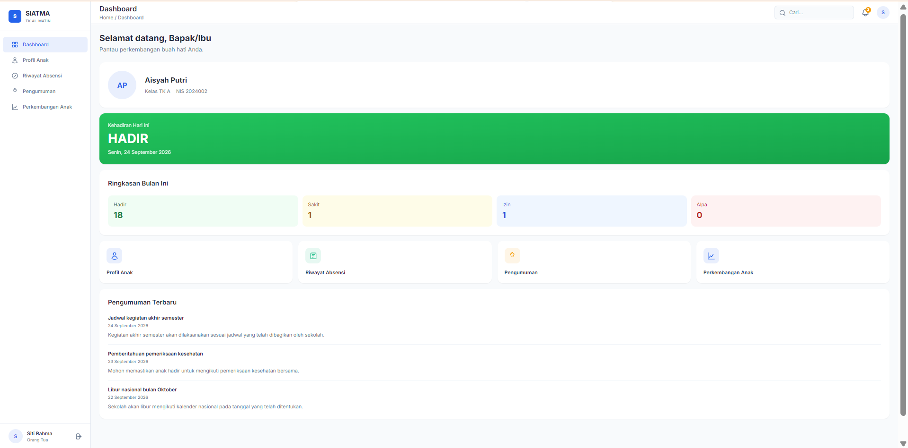

# SIATMA — Sistem Informasi Akademik TK Al-Matin

**SIATMA adalah aplikasi web multi-role untuk membantu sekolah mengelola data siswa dan guru, absensi, perkembangan anak, pengumuman, serta laporan dalam satu antarmuka yang responsif.**

> Jelajahi demo: **[siatma.vercel.app](https://siatma.vercel.app/)**




SIATMA (Sistem Informasi Akademik TK Al-Matin) dikembangkan sebagai proyek Kerja Praktik Program Studi Informatika, Universitas Pamulang. Aplikasi menyajikan alur yang berbeda untuk **Admin**, **Guru**, dan **Orang Tua**, supaya aktivitas akademik dan komunikasi sekolah lebih mudah diakses dari satu tempat.

> **Status:** SIATMA merupakan prototipe front-end interaktif dengan data contoh dan penyimpanan browser. Aplikasi belum terhubung ke backend atau database produksi. Jangan gunakan data pribadi nyata.

## Kolaborasi

Proyek ini merupakan hasil Kerja Praktik mahasiswa Informatika Universitas Pamulang di TK Al-Matin.

<div align="center">
  
  &nbsp;&nbsp;×&nbsp;&nbsp;
  
</div>

<div align="center">
  <strong>RA Al-Matin</strong> &nbsp;×&nbsp; <strong>Universitas Pamulang</strong>
</div>

Proyek ini dikembangkan sebagai bagian dari mata kuliah Kerja Praktik (KP) Program Studi Informatika, Universitas Pamulang, tahun akademik 2026/2027.

## Fitur

### Admin

- Dashboard ringkasan data siswa, guru, kelas, dan kehadiran.
- Pengelolaan data siswa dan guru dengan pencarian, filter, detail, formulir, serta perubahan status.
- Pengelolaan kelas dan pemetaan guru/siswa.
- Pencatatan absensi berdasarkan kelas dan tanggal.
- Pembuatan pengumuman dengan target penerima, tampilan detail modal, dan berbagi melalui WhatsApp.
- Catatan perkembangan siswa berdasarkan kategori.
- Preview laporan siswa, guru, kelas, dan rekap absensi; filter kelas/periode, cetak, ekspor CSV, serta unduh PDF.
- Pengaturan profil, akun demo, password, informasi sekolah, dan foto profil.

### Guru

- Dashboard kelas dan ringkasan kehadiran.
- Pencatatan absensi dan perkembangan siswa.
- Akses pengumuman sekolah dan kelas.

### Orang Tua

- Portal untuk melihat profil anak, riwayat absensi, pengumuman, dan perkembangan anak.

### Pengalaman aplikasi

- Layout navigasi bersama yang menyesuaikan peran pengguna.
- Antarmuka responsif dan dukungan tema gelap.
- Toast untuk status jaringan dan aksi aplikasi.
- Dukungan PWA: instalasi dan cache halaman untuk akses offline; data offline tidak disinkronkan antarperangkat.

> Import Excel saat ini masih berupa antarmuka/preview prototipe, bukan alur impor produksi. Penyimpanan data juga berjalan di sisi browser dan perlu diintegrasikan dengan backend sebelum penggunaan operasional.

## Teknologi

| Kategori | Teknologi | Keterangan |
|---|---|---|
| Markup | HTML5 | Struktur halaman multi-page dan elemen semantik. |
| Styling | Tailwind CSS melalui CDN | Mempercepat penyusunan antarmuka dan mendukung desain responsif tanpa proses build CSS. |
| Interaksi | Vanilla JavaScript | Mengelola navigasi, tampilan data, pencarian/filter, formulir, dan interaksi antarmuka. |
| Penyimpanan prototipe | `localStorage` dan `sessionStorage` | Menyimpan data demo dan sesi login di browser. Tidak menggantikan database atau autentikasi server. |
| PWA | Service Worker dan Web App Manifest | Mendukung instalasi aplikasi serta cache halaman untuk akses offline. |
| Hosting demo | Vercel | Menyajikan aplikasi front-end sebagai situs statis. |

## Struktur Project

```bash
siatma/
├── index.html                    # Halaman login
├── admin/                        # Halaman dan dashboard admin
│   ├── absensi.html              # Halaman absensi
│   ├── dashboard.html            # Ringkasan dashboard admin
│   ├── data-guru.html            # Daftar data guru
│   ├── data-kelas.html           # Daftar kelas
│   ├── data-siswa.html           # Daftar data siswa
│   ├── detail-guru.html          # Detail guru
│   ├── detail-siswa.html         # Detail siswa
│   ├── import-excel.html         # Antarmuka import dan preview Excel
│   ├── laporan.html              # Preview dan aksi laporan
│   ├── pengaturan.html           # Pengaturan sekolah/akun
│   ├── pengumuman.html           # Pengelolaan pengumuman
│   ├── perkembangan.html         # Catatan perkembangan siswa
│   └── tambah-siswa.html         # Form tambah data siswa
├── guru/                         # Halaman guru
│   ├── absensi.html              # Halaman absensi guru
│   └── dashboard.html            # Dashboard guru
├── orangtua/                     # Portal orang tua
│   ├── dashboard.html            # Dashboard orang tua
│   ├── pengumuman.html           # Pengumuman untuk orang tua
│   ├── perkembangan.html         # Perkembangan anak
│   ├── profil-anak.html          # Profil anak
│   └── riwayat-absensi.html      # Riwayat kehadiran anak
├── js/
│   ├── auth.js                   # Autentikasi dan sesi demo
│   ├── data.js                   # Data contoh dan helper data
│   ├── layout.js                 # Navigasi dan header sesuai role
│   ├── network-status.js         # Notifikasi status koneksi
│   └── ui-helpers.js             # Helper tampilan bersama
├── assets/
│   ├── logo-tk.png               # Logo RA Al-Matin
│   ├── logo-unpam.png            # Logo Universitas Pamulang
│   └── screenshots/              # Screenshot aplikasi
├── manifest.json                 # Metadata instalasi PWA
├── service-worker.js             # Cache halaman dan fallback offline
├── offline.html                  # Halaman saat konten tidak tersedia offline
├── LICENSE                       # Lisensi MIT
├── .vscode/
│   └── settings.json             # Pengaturan editor workspace
```

## Cara Menjalankan

### Prasyarat

- Browser modern seperti Chrome, Edge, Firefox, atau Safari.
- Koneksi internet untuk memuat Tailwind CSS dan font dari CDN.
- **Opsional:** Node.js dan npm jika ingin menjalankan server lokal melalui `npx serve`.

### 1. Clone repository

```bash
git clone https://github.com/Roy-Grumblr/Al-Matin-siatma.git
cd Al-Matin-siatma
```

### 2. Jalankan melalui server lokal

Anda dapat membuka folder melalui ekstensi **Live Server** di Visual Studio Code. Atau, jalankan server statis dengan Node.js:

```bash
npx serve -l 8000 .
```

### 3. Buka aplikasi

Buka alamat yang ditampilkan oleh server, biasanya:

```text
http://localhost:8000
```

Jika port `8000` sedang digunakan, pilih port lain dan sesuaikan alamat yang dibuka. Jalankan melalui server lokal (bukan `file://`) agar navigasi antarhalaman dan resource berjalan sebagaimana mestinya.

## Akun Demo

| Role | Username | Password | Redirect |
|---|---|---|---|
| Admin | `admin` | `admin123` | `admin/dashboard.html` |
| Guru | `guru` | `guru123` | `guru/dashboard.html` |
| Orang Tua | `orangtua` | `ortu123` | `orangtua/dashboard.html` |

> **Khusus testing/demo.** Kredensial disimpan sebagai data contoh di sisi klien dan tidak aman untuk penggunaan nyata. Jangan gunakan password ini untuk akun lain.

## Screenshot / Preview

Screenshot aplikasi disimpan di `assets/screenshots/`.

### Login



### Dashboard Admin


### Data Siswa



### Absensi



### Portal Orang Tua



## Aset

- Logo TK Al-Matin: digunakan dengan izin dari pihak TK Al-Matin.
- Logo Universitas Pamulang: digunakan dengan izin dari Universitas Pamulang.
- Screenshot: diambil dari aplikasi versi terkini.

## Arsitektur & Cara Kerja

### Layout injection

Halaman admin, guru, dan orang tua menyediakan elemen placeholder untuk sidebar dan header. `js/layout.js` memilih menu berdasarkan role, lalu merender sidebar dan header ke elemen tersebut. Setiap halaman menginisialisasi layout dengan konfigurasi seperti role, menu aktif, judul, dan breadcrumb.

### Alur autentikasi demo

`js/auth.js` mencocokkan username dan password terhadap data pengguna contoh di `js/data.js`. Sesi demo disimpan di `localStorage` jika opsi “Ingat saya” dipilih, atau di `sessionStorage` untuk sesi sementara. Halaman memeriksa role di sisi klien dan mengarahkan pengguna ke halaman yang sesuai. Mekanisme ini hanya untuk demonstrasi: pemeriksaan di browser tidak aman sebagai perlindungan akses produksi.

```text
┌──────────────┐    validasi     ┌────────────────┐
│ Form Login   │ ──────────────> │ js/data.js     │
└──────────────┘                 │ akun contoh    │
        │                        └───────┬────────┘
        │ berhasil                       │ cocok
        v                                v
┌────────────────┐                ┌───────────────────┐
│ Browser Storage│ <───────────── │ Simpan sesi demo  │
│ local/session  │                └───────────────────┘
└───────┬────────┘
        │ requireAuth(role)
        v
┌──────────────────────────┐
│ Halaman sesuai role      │
│ Admin / Guru / Orang Tua │
└──────────────────────────┘
```

### Mock data dan pengembangan backend

Data contoh beserta helper berada di `js/data.js` dan dipakai oleh halaman front-end sebagai sumber data prototipe. Pada pengembangan berikutnya, helper tersebut dapat diganti atau dihubungkan ke API backend. Untuk penggunaan nyata, autentikasi, otorisasi, validasi, dan penyimpanan data harus ditangani secara aman di server.

## Roadmap / Future Development

- [ ] Backend API dan database untuk data sekolah, akun, dan sesi.
- [ ] Autentikasi server, otorisasi per role, serta pencatatan aktivitas.
- [ ] Import Excel sungguhan dengan parsing, validasi, dan penyimpanan.
- [ ] Sinkronisasi data lintas perangkat dan strategi pencadangan.
- [ ] Pengujian otomatis untuk alur utama setiap role.
- [ ] Peningkatan aksesibilitas dan performa untuk penggunaan harian.
- [ ] Aplikasi mobile untuk akses yang lebih praktis.

## Kontribusi

Kontribusi, ide, dan laporan bug sangat dipersilakan. Untuk perubahan yang cukup besar, silakan buat issue terlebih dahulu agar usulan dapat didiskusikan.

1. Fork repository ini.
2. Buat branch fitur atau perbaikan: `git checkout -b fitur/nama-fitur`.
3. Buat perubahan dan commit dengan pesan yang jelas.
4. Push branch ke fork Anda: `git push origin fitur/nama-fitur`.
5. Ajukan Pull Request ke repository utama dan jelaskan perubahan yang dibuat.

## Lisensi

Project ini menggunakan **MIT License**. Lihat berkas `LICENSE` untuk ketentuan lisensi lengkap.

## Kontak / Author

| Informasi | Detail |
|---|---|
| Nama | Royan Alfa Rezza |
| NIM | 231011450102 |
| Program Studi | Informatika |
| Kampus | Universitas Pamulang |
| Email | royanalfarezza41@gmail.com |
| LinkedIn | www.linkedin.com/in/royanalfarezza |
| GitHub | https://github.com/Roy-Grumblr/Al-Matin-siatma |
