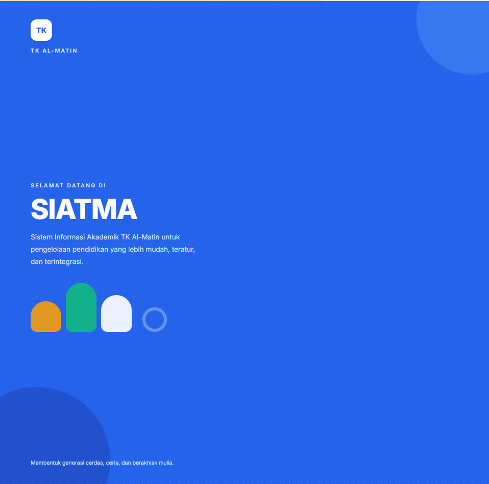

# SIATMA

### Sistem Informasi Akademik TK Al-Matin


> **Lihat demo:** [🌐 Buka SIATMA Live Demo](https://siatma.vercel.app/)



## Tentang Project

Administrasi di lingkungan taman kanak-kanak melibatkan banyak data dan kegiatan rutin, mulai dari pencatatan identitas siswa, absensi, hingga penyampaian informasi kepada orang tua. Jika proses tersebut dilakukan secara manual atau tersebar di berbagai media, pencarian data dan penyusunan rekap dapat memerlukan waktu lebih lama serta berisiko menimbulkan pencatatan yang tidak konsisten.

SIATMA (Sistem Informasi Akademik TK Al-Matin) adalah prototipe aplikasi web untuk membantu digitalisasi proses administrasi di TK Al-Matin. Aplikasi menyediakan tampilan dan alur kerja terpisah bagi admin, guru, dan orang tua, termasuk pengelolaan data akademik, absensi, pengumuman, serta informasi perkembangan siswa.

Proyek Kerja Praktik mahasiswa Informatika ini bertujuan merancang antarmuka sistem yang mudah digunakan, merapikan alur informasi sekolah, dan menjadi fondasi untuk pengembangan sistem akademik yang terhubung dengan backend dan basis data pada tahap berikutnya.

> **Status aplikasi:** Versi ini merupakan prototipe front-end dengan data contoh. Autentikasi demo memakai `localStorage`; aplikasi belum menggunakan server autentikasi atau database produksi. Jangan gunakan data pribadi nyata.

## Kolaborasi

Proyek ini merupakan hasil Kerja Praktik mahasiswa Informatika Universitas Pamulang di TK Al-Matin.

<div align="center">
  
  &nbsp;&nbsp;×&nbsp;&nbsp;
  
</div>

<div align="center">
  <strong>RA Al-Matin</strong> &nbsp;×&nbsp; <strong>Universitas Pamulang</strong>
</div>

Proyek ini dikembangkan sebagai bagian dari mata kuliah Kerja Praktik (KP) Program Studi Informatika, Universitas Pamulang, tahun akademik 2026/2027.

## Fitur Utama

### 🛠️ Admin

- 📊 Dashboard ringkasan statistik siswa, guru, kelas, dan absensi.
- 👧 Manajemen data siswa: alur CRUD, pencarian, filter, detail, dan formulir.
- 📥 Halaman import Excel dengan preview dan validasi contoh; pemrosesan file nyata masih perlu diintegrasikan.
- 👩‍🏫 Manajemen data guru dengan alur CRUD, pencarian, dan filter; informasi kelas disajikan dalam tampilan kartu.
- 🗓️ Input absensi berdasarkan kelas dan tanggal dengan status Hadir, Sakit, Izin, atau Alpa, serta tampilan rekap kehadiran.
- 📣 Pembuatan dan penayangan pengumuman dengan sasaran penerima.
- 🌱 Pencatatan perkembangan siswa dalam kategori Bahasa, Motorik, Sosial, Kognitif, dan Kemandirian.
- 📄 Laporan dengan preview dan pilihan aksi ekspor PDF/Excel atau cetak.
- ⚙️ Pengaturan profil, akun, password, dan informasi sekolah.

### 👩‍🏫 Guru

- 🏠 Dashboard guru.
- ✅ Halaman absensi kelas dan pencatatan perkembangan siswa.
- 📣 Navigasi untuk informasi pengumuman.

### 👨‍👩‍👧 Orang Tua

- 🏠 Dashboard portal orang tua.
- 🧒 Profil anak.
- 📅 Riwayat absensi.
- 📣 Informasi pengumuman.
- 🌱 Informasi perkembangan anak.

### ✨ Sorotan

- **Absensi digital:** antarmuka pencatatan kehadiran dengan status Hadir, Sakit, Izin, dan Alpa.
- **Import Excel:** rancangan alur unggah, preview, dan validasi data sebagai dasar integrasi import sesungguhnya.
- **Portal orang tua:** akses terpusat untuk melihat profil anak, absensi, pengumuman, dan perkembangan.
- **Multi-role:** navigasi dan tujuan halaman menyesuaikan peran pengguna.
- **Responsif:** layout dirancang agar nyaman digunakan di desktop, tablet, dan perangkat mobile.

> Sebagian halaman saat ini berisi data statis atau mockup. Persistensi CRUD, pembacaan file Excel, serta pembuatan PDF/Excel perlu dihubungkan ke implementasi nyata sebelum digunakan operasional.

## Teknologi

| Kategori | Teknologi | Keterangan |
|---|---|---|
| Markup | HTML5 | Struktur halaman multi-page dan elemen semantik. |
| Styling | Tailwind CSS melalui CDN | Mempercepat penyusunan antarmuka dan mendukung desain responsif tanpa proses build CSS. |
| Interaksi | Vanilla JavaScript | Menangani autentikasi demo, layout injection, dan helper data tanpa framework tambahan. |
| Penyimpanan sesi demo | `localStorage` | Menyimpan sesi login pada browser untuk simulasi alur multi-role. Bukan mekanisme autentikasi produksi. |
| Hosting | Vercel | Hosting statis yang sederhana untuk aplikasi front-end. |

## Struktur Project

```bash
siatma/
├── index.html                    # Halaman login
├── _layout.html                  # Template/layout dasar
├── admin/                        # Halaman dan dashboard admin
│   ├── absensi.html              # Halaman absensi
│   ├── dashboard.html            # Ringkasan dashboard admin
│   ├── data-guru.html            # Daftar data guru
│   ├── data-kelas.html           # Daftar kelas
│   ├── data-siswa.html           # Daftar data siswa
│   ├── detail-guru.html          # Detail guru
│   ├── detail-siswa.html         # Detail siswa
│   ├── import-excel.html         # Antarmuka import dan preview Excel
│   ├── laporan.html              # Preview dan aksi laporan
│   ├── pengaturan.html           # Pengaturan sekolah/akun
│   ├── pengumuman.html           # Pengelolaan pengumuman
│   ├── perkembangan.html         # Catatan perkembangan siswa
│   └── tambah-siswa.html         # Form tambah data siswa
├── guru/                         # Halaman guru
│   ├── absensi.html              # Halaman absensi guru
│   └── dashboard.html            # Dashboard guru
├── orangtua/                     # Portal orang tua
│   ├── dashboard.html            # Dashboard orang tua
│   ├── pengumuman.html           # Pengumuman untuk orang tua
│   ├── perkembangan.html         # Perkembangan anak
│   ├── profil-anak.html          # Profil anak
│   └── riwayat-absensi.html      # Riwayat kehadiran anak
├── js/
│   ├── auth.js                   # Login, logout, sesi, dan proteksi halaman demo
│   ├── data.js                   # Mock data dan helper akses data
│   └── layout.js                 # Injection sidebar/header sesuai role
├── assets/
│   ├── logo-tk.png               # Logo RA Al-Matin
│   ├── logo-unpam.png            # Logo Universitas Pamulang
│   └── screenshots/              # Screenshot aplikasi
├── .vscode/
│   └── settings.json             # Pengaturan editor workspace
└── screenshots/                  # Tambahkan screenshot aplikasi di sini
```

## Cara Menjalankan

### Prasyarat

- Browser modern seperti Chrome, Edge, Firefox, atau Safari.
- Koneksi internet untuk memuat Tailwind CSS dan font dari CDN.
- **Opsional:** Node.js dan npm jika ingin menjalankan server lokal melalui `npx serve`.

### 1. Clone repository

```bash
git clone https://github.com/Roy-Grumblr/Al-Matin-siatma.git
cd Al-Matin-siatma
```

### 2. Jalankan melalui server lokal

Anda dapat membuka folder melalui ekstensi **Live Server** di Visual Studio Code. Atau, jalankan server statis dengan Node.js:

```bash
npx serve -l 8000 .
```

### 3. Buka aplikasi

Buka alamat yang ditampilkan oleh server, biasanya:

```text
http://localhost:8000
```

Jika port `8000` sedang digunakan, pilih port lain dan sesuaikan alamat yang dibuka. Jalankan melalui server lokal (bukan `file://`) agar navigasi antarhalaman dan resource berjalan sebagaimana mestinya.

## Akun Demo

| Role | Username | Password | Redirect |
|---|---|---|---|
| Admin | `admin` | `admin123` | `admin/dashboard.html` |
| Guru | `guru` | `guru123` | `guru/dashboard.html` |
| Orang Tua | `orangtua` | `ortu123` | `orangtua/dashboard.html` |

> **Khusus testing/demo.** Kredensial disimpan sebagai data contoh di sisi klien dan tidak aman untuk penggunaan nyata. Jangan gunakan password ini untuk akun lain.

## Screenshot / Preview

Screenshot aplikasi disimpan di `assets/screenshots/`.

### Login


### Dashboard Admin


### Data Siswa


### Absensi


### Portal Orang Tua


## Aset

- Logo TK Al-Matin: digunakan dengan izin dari pihak TK Al-Matin.
- Logo Universitas Pamulang: digunakan dengan izin dari Universitas Pamulang.
- Screenshot: diambil dari aplikasi versi terkini.

## Arsitektur & Cara Kerja

### Layout injection

Halaman admin, guru, dan orang tua menyediakan elemen placeholder untuk sidebar dan header. `js/layout.js` memilih menu berdasarkan role, lalu merender sidebar dan header ke elemen tersebut. Setiap halaman menginisialisasi layout dengan konfigurasi seperti role, menu aktif, judul, dan breadcrumb.

### Alur autentikasi demo

`js/auth.js` mencocokkan username dan password terhadap daftar pengguna contoh di `js/data.js`. Saat berhasil login, informasi pengguna (tanpa password) disimpan pada `localStorage` dengan key `siatma_user`. Halaman memanggil `requireAuth` untuk memeriksa sesi dan role; pengguna tanpa sesi diarahkan ke login, sedangkan role yang tidak sesuai diarahkan ke dashboard perannya.

```text
┌──────────────┐    validasi     ┌────────────────┐
│ Form Login   │ ──────────────> │ js/data.js     │
└──────────────┘                 │ akun contoh    │
        │                        └───────┬────────┘
        │ berhasil                       │ cocok
        v                                v
┌────────────────┐                ┌───────────────────┐
│ localStorage   │ <───────────── │ Simpan sesi demo  │
│ siatma_user    │                └───────────────────┘
└───────┬────────┘
        │ requireAuth(role)
        v
┌──────────────────────────┐
│ Halaman sesuai role      │
│ Admin / Guru / Orang Tua │
└──────────────────────────┘
```

### Mock data dan pengembangan backend

Data contoh beserta helper berada di `js/data.js` dan dipakai oleh halaman front-end sebagai sumber data prototipe. Pada pengembangan berikutnya, helper tersebut dapat diganti atau dihubungkan ke API backend. Untuk penggunaan nyata, autentikasi, otorisasi, validasi, dan penyimpanan data harus ditangani secara aman di server.

## Roadmap / Future Development

- [ ] Backend API menggunakan Node.js dan Express.
- [ ] Database MySQL dengan Sequelize ORM.
- [ ] Notifikasi WhatsApp untuk informasi sekolah dan absensi.
- [ ] Aplikasi mobile untuk akses yang lebih praktis.
- [ ] Import Excel sungguhan dengan validasi dan penyimpanan data.
- [ ] Export laporan PDF sungguhan.
- [ ] Penguatan autentikasi dan otorisasi berbasis server.

## Kontribusi

Kontribusi, ide, dan laporan bug sangat dipersilakan. Untuk perubahan yang cukup besar, silakan buat issue terlebih dahulu agar usulan dapat didiskusikan.

1. Fork repository ini.
2. Buat branch fitur atau perbaikan: `git checkout -b fitur/nama-fitur`.
3. Buat perubahan dan commit dengan pesan yang jelas.
4. Push branch ke fork Anda: `git push origin fitur/nama-fitur`.
5. Ajukan Pull Request ke repository utama dan jelaskan perubahan yang dibuat.

## Lisensi

Project ini menggunakan **MIT License**. Lihat berkas `LICENSE` untuk ketentuan lisensi lengkap.

## Kontak / Author

| Informasi | Detail |
|---|---|
| Nama | Royan Alfa Rezza |
| NIM | 231011450102 |
| Program Studi | Informatika |
| Kampus | Universitas Pamulang |
| Email | royanalfarezza41@gmail.com |
| LinkedIn | www.linkedin.com/in/royanalfarezza |
| GitHub | https://github.com/Roy-Grumblr/Al-Matin-siatma |
